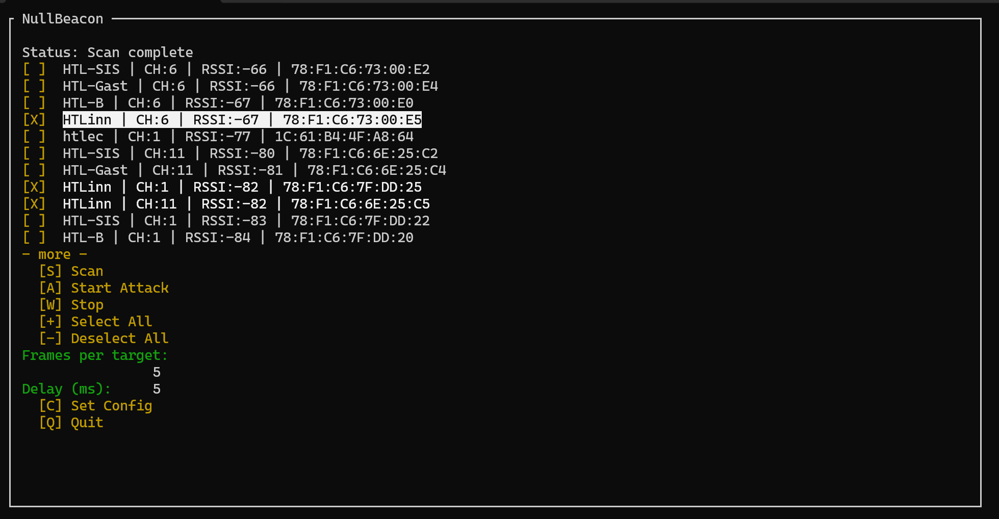
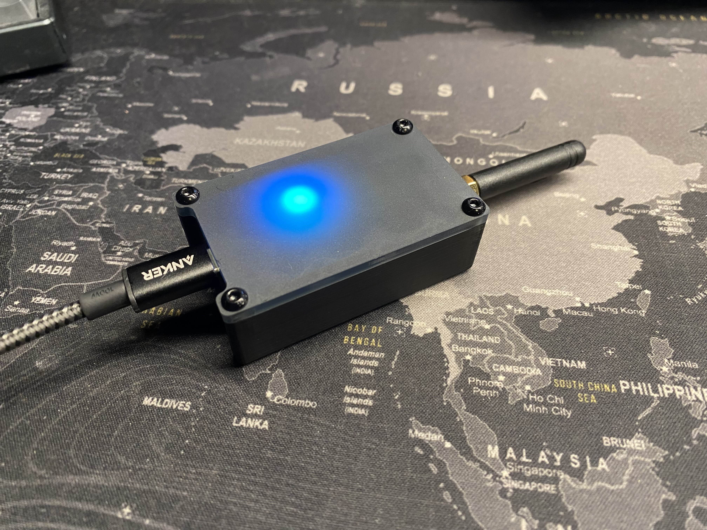
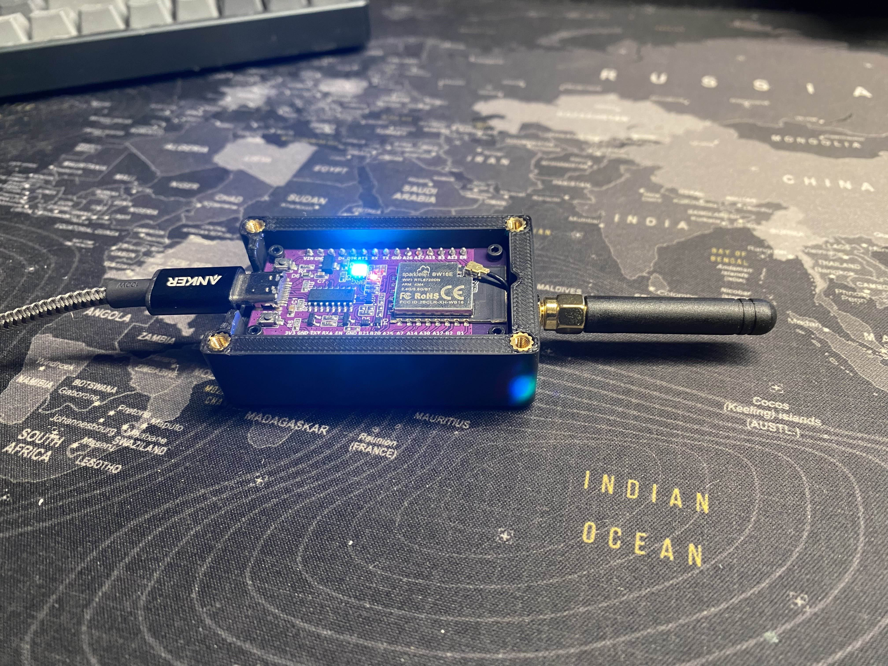

# 🚨 NullBeacon

A full-featured, open-source WiFi Deauther & Scanner using the **Realtek RTL8720DN (BW16)** module – with a slick Python **TUI (Terminal UI)** and **RGB status LEDs**.

> 🧑‍💻 **Note:** This is my **first open-source project** – I'm happy to receive any kind of feedback, suggestions, or constructive criticism!



---

## ✨ Features

- 🔎 **WiFi Network Scanner** with signal strength and channel info
- 💣 **Deauthentication attack** (multi-target support)
- 🎛 **Adjustable frame count and delay**
- 🌈 **RGB LED status**: idle, scan, attack
- 🖥 **Python Terminal UI** with:
  - Multi-select & deselect
  - Live status indicator
  - Keyboard shortcuts (Scan, Attack, Stop, Quit)
  - Select/Deselect All buttons

---

## 🧠 Disclaimer

> This project is for **educational and authorized testing purposes only**.  
> Do **not** use it on networks you don’t own or have explicit permission to test.  
> Misuse may be illegal.

---

## 📦 Project Structure
```
NullBeacon/
├── firmware/ # Arduino-based BW16 firmware (C++)
├── hardware/ # Hardware for the Project (Case)
├── tui/ # Python terminal interface (TUI)
├── docs/ # Images
├── LICENSE
├── README.md
└── .gitignore
```
---

## ⚙️ Requirements

### Firmware (Arduino IDE)

- Board: Ai-Thinker BW16 / RTL8720DN
- Library: Realtek Ameba RTL8720DN
- Arduino Core for BW16: [amebad](https://github.com/ambiot/ambd_arduino)

### Python TUI

Install requirements via:

```
pip install -r requirements.txt
```
## 🚀 Quick Start

📡 Upload Firmware
Open firmware/firmware.ino in Arduino IDE

Select board: Ai-Thinker BW16

Upload to your device via USB

🖥 Launch the TUI
```
cd tui/
python main.py
```
⌨️ TUI Shortcuts
Key	Action
- `s`	Scan networks
- `a`	Start deauth attack
- `x`	Stop attack
- `c`	Set config
- `+`	Select all
- `-`	Deselect all
- `q`	Quit the UI
- `␣`	(Space) toggle selection

## 🧰 Hardware Requirements
To assemble and use this project, you will need the following hardware components:

### Fasteners and Inserts:
- 4 × M3 threaded inserts for 3D printing
- 4 × M2 threaded inserts for 3D printing
- 4 × M3 × 8 mm screws
- 4 × M2 × 3.5 mm screws

### Electronics:
- 1 × BW16 Microcontroller
- 1 × U.FL to SMA Adapter

### Case:
This case features a 3D-printed bottom and a laser-cut PMMA top.




❤️ Contributing

Pull requests welcome!

📝 License

GPLv3

Thanks to https://github.com/tesa-klebeband/RTL8720dn-Deauther for most of the original firmware code